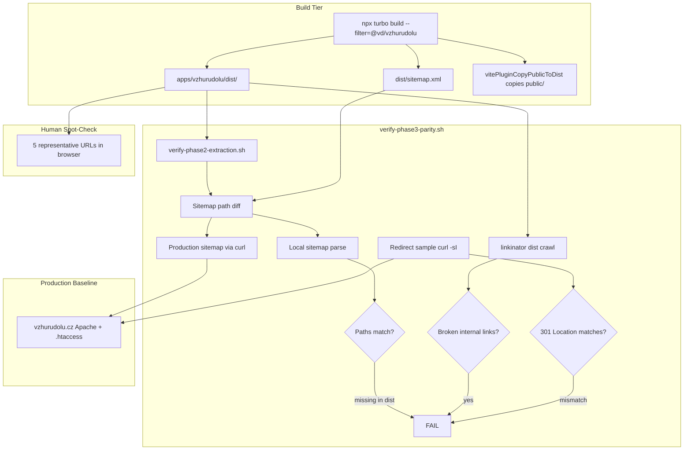

# Phase 3: Czech Site Parity Verification - Research

**Researched:** 2026-06-07
**Domain:** Static-site parity verification (URL inventory, redirects, link integrity, public asset audit)
**Confidence:** HIGH

## Summary

Phase 3 validates that `apps/vzhurudolu` monorepo builds match live FTP production (`https://www.vzhurudolu.cz`) before any Vercel migration. The brownfield site is a ~870-page Astro 4 SSG with a custom sitemap integration, Apache `.htaccess` redirect rules (311 lines, 57 `Redirect`/`RewriteRule` directives), and a **685 MB** `public/` tree copied wholesale into `dist/` on every build via `vitePluginCopyPublicToDist()`.

Production baseline is authoritative: live sitemap currently lists **873 URLs** [VERIFIED: curl production sitemap 2026-06-07]. Phase 2 local builds reported ~871 URLs — counts are aligned within expected drift. Parity methodology (D-01) compares URL inventory + HTTP status + redirect chains, not full HTML diff.

The phase extends existing shell-gate patterns (`verify-phase1-build.sh`, `verify-phase2-extraction.sh`) with a new `scripts/verify-phase3-parity.sh` composing: (1) Phase 1+2 gates, (2) sitemap path diff vs production, (3) dist internal link crawl, (4) sampled `.htaccess` redirect chain checks against production, (5) manual spot-check of 5 representative pages. No new unit-test framework — verification stays shell + optional CI step in `pr-build.yml`.

**Primary recommendation:** Use **`linkinator` via `npx`** for dist link checks (`--recurse --clean-urls`); implement sitemap path diff and redirect sampling in bash; document `public/` inventory in `03-PUBLIC-ASSET-AUDIT.md` without deleting archives.

<user_constraints>
## User Constraints (from CONTEXT.md)

### Locked Decisions

#### Parity Comparison Methodology
- **D-01:** Compare URL inventory + HTTP status + redirect chains against live `vzhurudolu.cz` (not full HTML diff of all pages).
- **D-02:** Live FTP production (`vzhurudolu.cz`) is the source of truth baseline.
- **D-03:** Pass criteria: zero broken internal links in `dist/`, top `.htaccess` redirects behave identically, draft slugs absent from output (carried from Phase 1).
- **D-04:** Primary gate: CI script `scripts/verify-phase3-parity.sh` plus manual spot-check of a URL sample.

#### Link Checker
- **D-05:** Scope: internal links only within `apps/vzhurudolu/dist/` (blog, příručka, podcast, static pages).
- **D-06:** Tool: `linkinator` or `lychee` run against dist after build.
- **D-07:** Ignore: `#anchors`, `mailto:`, `data:` URIs, legacy `/style/` preview paths.
- **D-08:** CI: add link check as optional step in `pr-build.yml` (fail on 404); full CI gate can harden in Phase 4.

#### Public Asset Audit (685 MB)
- **D-09:** Audit scope: inventory + categorization (`public/data/` archives vs active assets) — no deletion in Phase 3.
- **D-10:** Verify turbo build completes under 5 minutes; document bottleneck if not.
- **D-11:** Keep existing `vitePluginCopyPublicToDist()` behavior — parity first, optimization deferred to Phase 4+.
- **D-12:** Deliverable: `03-PUBLIC-ASSET-AUDIT.md` with size table and recommendations.

#### Phase Scope Boundaries
- **D-13:** Vercel redirects and `.htaccess` → `vercel.json` port: out of scope (Phase 4).
- **D-14:** EN app (`michalek.dev`): out of scope — only `apps/vzhurudolu`.
- **D-15:** Visual verification: spot-check 5 pages (homepage, blog article, příručka article, podcast episode, kurz page) — not pixel-perfect Percy/Chromatic.
- **D-16:** On phase pass, Phase 4 (Vercel migration) may proceed without re-running Phase 2.

#### Carried Forward
- **D-17:** Phase 2 move-only extraction complete; Phase 3 validates VD-01 deferred from D-11.
- **D-18:** Existing gates remain: `verify-phase1-build.sh`, `verify-phase2-extraction.sh` must stay green.

### Claude's Discretion
- Exact link checker tool choice (`linkinator` vs `lychee`) based on install footprint and CI compatibility
- URL sample size for redirect comparison (top N from `.htaccess` inventory)
- Which 5 spot-check URLs to document in verification plan

### Deferred Ideas (OUT OF SCOPE)
- Full HTML diff of all pages — too expensive; URL/status/redirect sufficient
- Percy/Chromatic visual regression — spot-check only
- Remove `public/data/` archives — document in audit, act in Phase 4+
- Vercel redirect port — Phase 4
- EN app parity — Phase 5+
</user_constraints>

<phase_requirements>
## Phase Requirements

| ID | Description | Research Support |
|----|-------------|------------------|
| VD-01 | Czech site builds from `apps/vzhurudolu` with output parity to current production (URLs, redirects, content) | Sitemap path diff (873 prod URLs), dist file existence map, redirect chain sampling against production, linkinator dist crawl, spot-check 5 pages |
| VD-05 | `public/` asset strategy preserves production behavior without build timeouts (685 MB audit applied) | Verified 685 MB inventory breakdown; `vitePluginCopyPublicToDist()` preserved; build-time measurement protocol; FTP excludes `data/` and `files/` from deploy |
</phase_requirements>

## Architectural Responsibility Map

| Capability | Primary Tier | Secondary Tier | Rationale |
|------------|-------------|----------------|-----------|
| URL inventory extraction | **CI / Shell scripts** | CDN / Static (sitemap.xml in dist) | Sitemap generated at Astro build time in `dist/sitemap.xml`; diff script runs post-build |
| Internal link integrity | **CI / Shell scripts** | Browser / Client (HTML hrefs) | linkinator crawls static HTML in `dist/` — no runtime server required |
| Redirect chain verification | **CI / Shell scripts** | CDN / Static (Apache `.htaccess` on production) | Redirects enforced by Apache on live host; static `dist/` has no redirect engine — test production only |
| Production baseline fetch | **CI / Shell scripts** | — | `curl` against `https://www.vzhurudolu.cz` for sitemap + redirect HEAD requests |
| Public asset inventory | **CI / Shell scripts** | CDN / Static (`public/` → `dist/`) | Size audit is filesystem `du`/`find`; copy behavior owned by Vite plugin in build tier |
| Spot-check visual parity | **Manual (human)** | — | D-15 explicitly excludes automated visual regression |
| Draft exclusion gate | **CI / Shell scripts** | Frontend Server (SSG `getStaticPaths`) | Carried from Phase 1 `verify-phase1-build.sh` |

## Standard Stack

### Core

| Library | Version | Purpose | Why Standard |
|---------|---------|---------|--------------|
| `linkinator` | 7.6.1 [VERIFIED: npm registry] | Crawl `dist/` HTML/CSS for broken internal links | Node-native; `npx` in existing CI; `--clean-urls` matches Astro `trailingSlash: 'never'` [CITED: github.com/JustinBeckwith/linkinator] |
| `bash` + `curl` | system | Sitemap diff, redirect chain sampling, production HEAD checks | Matches Phase 1/2 gate pattern; no new runtime |
| `grep`/`comm`/`sort` | system | Set diff on sitemap URL paths | Zero-dependency; adequate for ~870 URLs |

### Supporting

| Library | Version | Purpose | When to Use |
|---------|---------|---------|-------------|
| `linkinator.config.json` | — | Centralize `--skip` patterns for D-07 | When skip list grows beyond 4 patterns |
| `python3` + `xml.etree` | system | Robust sitemap XML parse (optional) | If `grep -oP` unavailable on target macOS (BSD grep lacks `-P`) |
| `lychee` | latest Rust binary [ASSUMED] | Alternative link checker | Only if linkinator proves inadequate — requires separate install step |

### Alternatives Considered

| Instead of | Could Use | Tradeoff |
|------------|-----------|----------|
| `linkinator` (recommended) | `lychee` | lychee is faster/async [CITED: lychee.cli.rs/overview] but needs Rust binary or `lychee-action` — extra CI complexity vs Node 22 already present |
| Sitemap path diff | Full-site HTML diff | D-01 locked: too expensive; URL inventory sufficient |
| linkinator on disk | `astro preview` + linkinator on localhost | Disk scan is faster, no server process; `--clean-urls` resolves extensionless paths |
| Production redirect test | Parse+simulate `.htaccess` locally | Apache rewrite semantics are complex; curl against live production is ground truth per D-02 |

**Installation (link checker only):**

```bash
# No package.json install required — use npx in verify script
npx linkinator@7.6.1 apps/vzhurudolu/dist --recurse --clean-urls
```

**Version verification:**

```bash
npm view linkinator version   # 7.6.1 (modified 2026-02-27)
```

## Package Legitimacy Audit

> slopcheck was unavailable at research time (install succeeded but binary not on PATH). linkinator tagged `[ASSUMED]` for planner checkpoint per graceful-degradation rule.

| Package | Registry | Age | Downloads | Source Repo | slopcheck | Disposition |
|---------|----------|-----|-----------|-------------|-----------|-------------|
| `linkinator` | npm | ~8 yrs | high | github.com/JustinBeckwith/linkinator | unavailable | Approved with `[ASSUMED]` — planner adds `checkpoint:human-verify` before first `npx` use |

**Packages removed due to slopcheck [SLOP] verdict:** none (slopcheck not run)
**Packages flagged as suspicious [SUS]:** none

`npm view linkinator scripts.postinstall` — no postinstall script [VERIFIED: npm registry]

## linkinator vs lychee — Decision

| Criterion | linkinator | lychee |
|-----------|------------|--------|
| CI install footprint | `npx linkinator` — zero repo dep [CITED: npmjs.com/package/linkinator] | `cargo install`, prebuilt binary, or `lychee-action` [CITED: lychee.cli.rs/guides/getting-started] |
| Astro clean URLs | `--clean-urls` flag native [CITED: github.com/JustinBeckwith/linkinator] | `--fallback-extensions html` + `--base-url` [ASSUMED] |
| Skip patterns | `--skip` regex, repeatable [CITED: github.com/JustinBeckwith/linkinator] | `--exclude` regex [CITED: github.com/lycheeverse/lychee] |
| Offline / local dist | Scans disk paths directly | `--offline` for file:// mode [ASSUMED] |
| Speed at ~870 pages | Adequate (defaults concurrency 100) | Faster (Rust async) — marginal gain for this scale |
| Fragment checking | `checkFragments` default checks anchors — **disable or skip `#` per D-07** | Fragment checking available [ASSUMED] |
| GitHub Action | `linkinator-action` exists | `lychee-action` mature |

**Recommendation: `linkinator`** — lowest friction in Node 22 CI already running `npm ci`; `--clean-urls` directly matches Astro config; no new toolchain.

## Architecture Patterns

### System Architecture Diagram



### Recommended Project Structure

```
scripts/
├── verify-phase1-build.sh      # existing — draft + _astro + sitemap
├── verify-phase2-extraction.sh # existing — @vd/shared gate
└── verify-phase3-parity.sh     # NEW — composes 1+2 + parity checks

apps/vzhurudolu/
├── dist/                       # linkinator target (post-build)
├── public/
│   ├── .htaccess               # 311 lines — redirect source for sampling
│   └── [685 MB assets]
└── astro.config.mjs            # trailingSlash: never, copy-public plugin

.planning/phases/03-czech-site-parity-verification/
├── 03-CONTEXT.md
├── 03-RESEARCH.md
└── 03-PUBLIC-ASSET-AUDIT.md    # NEW deliverable (D-12)

.github/workflows/
└── pr-build.yml                # add optional linkinator step (D-08)
```

### Pattern 1: Sitemap URL Inventory Diff

**What:** Extract normalized paths from local `dist/sitemap.xml` and production `https://www.vzhurudolu.cz/sitemap.xml`, diff sets.
**When to use:** Primary VD-01 URL parity gate (D-01).
**Production baseline:** 873 `<loc>` entries [VERIFIED: curl 2026-06-07].

**Example:**

```bash
#!/usr/bin/env bash
# Source: pattern derived from custom-sitemap.ts + production verification
PROD_SITEMAP=$(mktemp)
LOCAL_SITEMAP="apps/vzhurudolu/dist/sitemap.xml"
curl -sf "https://www.vzhurudolu.cz/sitemap.xml" -o "$PROD_SITEMAP"

extract_paths() {
  # Portable: sed instead of grep -P
  sed -n 's|.*<loc>https://www.vzhurudolu.cz\(.*\)</loc>.*|\1|p' "$1" | sort -u
}

extract_paths "$PROD_SITEMAP" > /tmp/prod.paths
extract_paths "$LOCAL_SITEMAP" > /tmp/local.paths

# URLs in production but missing from build — FAIL
MISSING=$(comm -23 /tmp/prod.paths /tmp/local.paths)
if [[ -n "$MISSING" ]]; then
  echo "FAIL: paths in production sitemap missing from dist:" >&2
  echo "$MISSING" | head -20 >&2
  exit 1
fi
```

**Secondary check:** For each path in local sitemap, verify dist file exists:

```bash
# Astro trailingSlash: never → /blog/foo → dist/blog/foo/index.html
path_to_file() {
  local p="$1"
  [[ "$p" == "/" ]] && echo "apps/vzhurudolu/dist/index.html" && return
  echo "apps/vzhurudolu/dist${p}/index.html"
}
```

### Pattern 2: Redirect Chain Sampling (Production Only)

**What:** Parse explicit `Redirect` and `RedirectMatch 301` rules from `public/.htaccess`, test top N against live production with `curl -sI`.
**When to use:** D-03 redirect parity — **not testable on static dist** (no Apache). Phase 4 ports these to `vercel.json`; Phase 3 confirms production behavior unchanged and documents expected chains for Phase 4.
**Inventory:** 57 `Redirect`/`RewriteRule` lines; ~35 are explicit 301 redirects (exclude internal `[L]` rewrites without `R=301`).

**Recommended sample size: 25 rules** (Claude's discretion) covering:
- Shortcuts: `/p/`, `/b/`, `/k/`, `/v/`, `/f/` (5)
- E-book redirects (5)
- Příručka typo fixes (5)
- Legacy `/data/` paths (3)
- Kurzy consolidation (3)
- AMP strip `/amp/` (1)
- Blog→podcast `/blog/77-css-v-js` (1)
- Misc: `/checklist`, `/lektori/martin-michalek`, `/frontend-frameworky` (2)

**Example:**

```bash
# Verified 2026-06-07 against production
# /prirucka/css3-flexbox → 301 → /prirucka/css-flexbox
curl -sI "https://www.vzhurudolu.cz/prirucka/css3-flexbox" | grep -i '^location:'
# location: https://www.vzhurudolu.cz/prirucka/css-flexbox

# /blog/77-css-v-js → 301 → /podcast/css-v-js
curl -sI "https://www.vzhurudolu.cz/blog/77-css-v-js" | grep -i '^location:'

# /p/css-flexbox → 301 → /prirucka/css-flexbox (shortcut)
curl -sI "https://www.vzhurudolu.cz/p/css-flexbox" | grep -i '^location:'
```

**Implementation:** Store expected `{source_path}:{expected_location_suffix}` pairs in `scripts/redirect-samples.txt` or inline array in `verify-phase3-parity.sh`. Compare `Location` header (normalize host, trailing slash).

**Do not sample in Phase 3:** `RewriteCond` blocks (www/HTTPS/trailing-slash) — infrastructure redirects; Phase 4 handles separately. `RedirectMatch 404` rules — test as 404 not redirect.

### Pattern 3: Internal Link Check (linkinator on dist)

**What:** Crawl built HTML in `apps/vzhurudolu/dist/` for broken same-site links.
**When to use:** D-05/D-06 after every build.

**Example:**

```bash
# Source: [CITED: github.com/JustinBeckwith/linkinator]
npx --yes linkinator@7.6.1 apps/vzhurudolu/dist \
  --recurse \
  --clean-urls \
  --skip '^mailto:' \
  --skip '^#' \
  --skip '^data:' \
  --skip '/style/' \
  --verbosity error
```

Optional `linkinator.config.json` at repo root:

```json
{
  "recurse": true,
  "cleanUrls": true,
  "skip": ["^mailto:", "^#", "^data:", "/style/"],
  "verbosity": "error"
}
```

**Note on external links:** D-05 scopes **internal links only**. Add `--skip '^(?!https://www\\.vzhurudolu\\.cz)'` or skip all `https://` except same-host to avoid flaky external 403/429 failures [CITED: github.com/JustinBeckwith/linkinator skip regex example].

### Pattern 4: Public Asset Inventory

**What:** Measure and categorize `apps/vzhurudolu/public/` without modifying archives.
**When to use:** VD-05 / D-09/D-12.

**Verified inventory (2026-06-07):**

| Path | Size | Category | Notes |
|------|------|----------|-------|
| `public/` (total) | **685 MB** | — | Matches CONCERNS.md |
| `public/assets/` | 501 MB | Active | CSS, JS, fonts, SCSS, images — production-critical |
| `public/data/` | 128 MB | Archive | Legacy blog HTML — **do not modify** per `.cursor/rules/archiv-public-data-files.md` |
| `public/files/` | 23 MB | Archive | Legacy downloads — **do not modify** |
| `public/prirucka/` | 34 MB | Active | Příručka static images |
| `public/.htaccess` | 13.7 KB | Active | 311 lines; copied to dist by plugin |
| `public/favicon*` | ~124 KB | Active | Icons |

**FTP deploy exclusion** (already configured): `data/**` and `files/**` excluded from FTP upload [VERIFIED: `.github/workflows/deploy-ftp.yml`] — but **full copy to dist still happens** via `vitePluginCopyPublicToDist()`. Audit documents this gap for Phase 4+ optimization (D-11).

**Audit commands:**

```bash
du -sh apps/vzhurudolu/public apps/vzhurudolu/public/* | sort -hr
find apps/vzhurudolu/public -type f | wc -l
# Post-build:
du -sh apps/vzhurudolu/dist
```

### Pattern 5: Spot-Check URLs (Manual D-15)

Document these 5 URLs in verification plan — representative, published, stable:

| Page type | URL | Rationale |
|-----------|-----|-----------|
| Homepage | `https://www.vzhurudolu.cz/` | Core entry; category listings |
| Blog article | `https://www.vzhurudolu.cz/blog/261-rok-2025` | Recent published post (`src/content/blog/261-rok-2025.md` exists) |
| Příručka article | `https://www.vzhurudolu.cz/prirucka/css-flexbox` | High-link-density markdown pipeline page |
| Podcast episode | `https://www.vzhurudolu.cz/podcast/219-figma-podcast` | `{postID}-{slug}` convention (`figma-podcast.md`, postID 219) |
| Kurz page | `https://www.vzhurudolu.cz/kurzy` | Static page; redirect rules reference `/kurzy` |

**Spot-check procedure:** Open each URL in browser; confirm 200, main content renders, navigation works, no console 404 on `/_astro/*.js` [per `.cursor/rules/astro-build.md`]. Compare local `astro preview` or dist-served equivalent side-by-side if desired — no pixel diff tooling.

### Anti-Patterns to Avoid

- **HTML diff all pages:** Locked out of scope (D-01 deferred); expensive and brittle for markdown pipeline sites.
- **linkinator against production:** Flaky (rate limits, external links); scope is `dist/` only per D-05.
- **Testing redirects on static dist:** `.htaccess` in dist is not executed without Apache — redirects must hit live production.
- **Deleting `public/data/` during audit:** Violates archive rules and D-09; document only.
- **Replacing shell gates with Jest/Vitest:** No test framework exists; Phase 3 follows established pattern.

## Don't Hand-Roll

| Problem | Don't Build | Use Instead | Why |
|---------|-------------|-------------|-----|
| Broken link detection | Custom href regex crawler | `linkinator` | Handles HTML, CSS `url()`, recursion, clean URLs, skip patterns |
| Sitemap XML parsing | Fragile regex-only for large XML | `sed`/`python3 xml.etree` | 873 URLs is small; but use robust parse if grep portability issues |
| Redirect chain following | Manual `Location` header parsing loop | `curl -sI` + expected map | curl is standard; full crawler overkill for 25 samples |
| Visual regression | Custom screenshot diff | Manual spot-check 5 URLs | D-15 locked; Percy/Chromatic deferred |
| Public size audit | Guessing from CONCERNS.md | `du -sh` per subdirectory | Numbers verified 685 MB live on disk |

**Key insight:** Parity verification is a **pipeline composition problem** — extend existing shell gates, don't introduce a parallel test framework for Phase 3.

## Project Constraints (from .cursor/rules/)

- **`archiv-public-data-files.md`:** Never modify `public/data/` or `public/files/` without explicit user confirmation; audit is read-only inventory.
- **`astro-build.md`:** `dist/_astro/` must exist and contain JS bundles — already enforced by `verify-phase1-build.sh`.
- **`content-odkazovani.md`:** Internal article links use `.md` format in source; linkinator validates built HTML output, not source markdown conventions.
- **No inline CSS / Czech typography rules:** Not applicable to verification scripts.

## Common Pitfalls

### Pitfall 1: Production Sitemap Drift During Verification

**What goes wrong:** Local build has 871 URLs, production 873 (or vice versa) — false FAIL or false PASS.
**Why it happens:** Content commits between production deploy and local build; sitemap excludes `style/` and `404` per `custom-sitemap.ts`.
**How to avoid:** Run diff against production sitemap fetched at verify time; document delta tolerance (0 missing prod paths = pass); extras in local only → WARN not FAIL if new published content.
**Warning signs:** `comm -23` shows >5 missing paths.

### Pitfall 2: linkinator Flags External Links

**What goes wrong:** CI fails on third-party 403/timeout (YouTube, Twitter, old CDNs).
**Why it happens:** Default crawl follows all `https://` hrefs.
**How to avoid:** `--skip` regex limiting to same-host or skip all external `https://` except `vzhurudolu.cz`.
**Warning signs:** Failures on `youtube.com`, `twitter.com`, `github.com`.

### Pitfall 3: Clean URL Mismatch

**What goes wrong:** linkinator reports 404 for `/blog/foo` when file is `dist/blog/foo/index.html`.
**Why it happens:** Missing `--clean-urls` while Astro uses `trailingSlash: 'never'`.
**How to avoid:** Always pass `--clean-urls` [CITED: github.com/JustinBeckwith/linkinator].
**Warning signs:** Mass 404s on valid article URLs.

### Pitfall 4: 685 MB Copy Extends CI Beyond 5 Minutes

**What goes wrong:** D-10 failure; CI timeout.
**Why it happens:** `vitePluginCopyPublicToDist()` copies entire `public/` including 128 MB `data/` every build.
**How to avoid:** Measure with `/usr/bin/time -p npx turbo run build --filter=@vd/vzhurudolu`; document copy duration separately; do not optimize in Phase 3 (D-11).
**Warning signs:** `[copy-public-to-dist]` log appears late in build; dist size ~685 MB+.

### Pitfall 5: Redirect Test Includes Internal Rewrites

**What goes wrong:** False failures testing `RewriteRule ... [L]` (no redirect) rules.
**Why it happens:** `.htaccess` mixes 301 redirects, internal rewrites, and trailing-slash logic.
**How to avoid:** Sample only lines with `Redirect`, `RedirectMatch 301`, or `RewriteRule` with `R=301`.
**Warning signs:** Expected 301 but got 200 on trailing-slash rewrite rules.

### Pitfall 6: `.htaccess` Exists but Redirects Not Tested on Dist

**What goes wrong:** Assuming copied `.htaccess` in dist proves redirect parity.
**Why it happens:** Static file servers and linkinator ignore Apache config.
**How to avoid:** Redirect tests target production only; dist check confirms `.htaccess` file present: `test -f apps/vzhurudolu/dist/.htaccess`.
**Warning signs:** Phase 4 surprise when porting to `vercel.json`.

## Code Examples

### verify-phase3-parity.sh skeleton

```bash
#!/usr/bin/env bash
set -euo pipefail
ROOT="$(cd "$(dirname "${BASH_SOURCE[0]}")/.." && pwd)"
cd "$ROOT"

echo "Phase 3 parity gate: Phase 2 extraction checks..."
bash scripts/verify-phase2-extraction.sh

echo "Phase 3 parity gate: sitemap path diff..."
# ... Pattern 1 ...

echo "Phase 3 parity gate: dist file existence..."
test -f apps/vzhurudolu/dist/.htaccess

echo "Phase 3 parity gate: internal link crawl..."
npx --yes linkinator@7.6.1 apps/vzhurudolu/dist \
  --recurse --clean-urls \
  --skip '^mailto:' --skip '^#' --skip '^data:' --skip '/style/' \
  --verbosity error

echo "Phase 3 parity gate: production redirect samples..."
# ... Pattern 2 ...

echo "Phase 3 parity gate: OK"
```

### pr-build.yml optional step (D-08)

```yaml
      - name: Link check (optional gate)
        run: |
          npx --yes linkinator@7.6.1 apps/vzhurudolu/dist \
            --recurse --clean-urls \
            --skip '^mailto:' --skip '^#' --skip '^data:' --skip '/style/' \
            --verbosity error
```

### Build timing (D-10)

```bash
/usr/bin/time -p npx turbo run build --filter=@vd/vzhurudolu 2>&1 | tee /tmp/phase3-build-timing.log
```

## State of the Art

| Old Approach | Current Approach | When Changed | Impact |
|--------------|------------------|--------------|--------|
| PR CI: no build | `pr-build.yml` runs turbo build + phase1 gate | Phase 1 | Build failures caught on PR |
| Manual link checking | linkinator in verify-phase3 | Phase 3 (planned) | Automated internal link gate |
| `@astrojs/sitemap` | `createCustomSitemap()` in `@vd/shared` | Pre-monorepo | Sitemap is `<loc>` only — diff uses paths not lastmod |
| FTP-only deploy verify | Production sitemap via curl as baseline | Phase 3 | Live site is truth per D-02 |

**Deprecated/outdated:**
- Full HTML parity diff — explicitly deferred in CONTEXT.md.

## Assumptions Log

| # | Claim | Section | Risk if Wrong |
|---|-------|---------|---------------|
| A1 | `linkinator --clean-urls` correctly resolves all Astro extensionless routes | Pattern 3 | False 404 failures — validate on 5 spot-check URLs first |
| A2 | Production sitemap (873 URLs) is complete URL inventory | Pattern 1 | Missing URLs not in sitemap won't be diffed — acceptable per D-01 |
| A3 | 25 redirect samples sufficient for `.htaccess` parity confidence | Pattern 2 | Edge-case redirect regression undetected until Phase 4 |
| A4 | Turbo build completes under 5 minutes on GitHub `ubuntu-latest` | VD-05 | CI timeout — measure in Wave 0 |
| A5 | Skipping external URLs in linkinator covers D-05 "internal only" intent | linkinator vs lychee | External broken links undetected — acceptable per scope |

## Open Questions

1. **Sitemap extras tolerance**
   - What we know: Local build may have URLs not yet deployed to production.
   - What's unclear: Should extras fail the gate or WARN only?
   - Recommendation: FAIL on missing prod paths; WARN on local-only extras (new content OK).

2. **linkinator external link policy**
   - What we know: D-05 says internal only.
   - What's unclear: Skip all external or check same-host only?
   - Recommendation: Skip all `https://` except `www.vzhurudolu.cz` and root-relative `/`.

3. **Build time on CI vs local**
   - What we know: Phase 2 estimated ~120s build; 685 MB copy may add time.
   - What's unclear: Whether GHA exceeds 5-minute D-10 threshold.
   - Recommendation: Wave 0 timing run; document in `03-PUBLIC-ASSET-AUDIT.md`.

## Environment Availability

| Dependency | Required By | Available | Version | Fallback |
|------------|------------|-----------|---------|----------|
| Node.js | turbo build, npx linkinator | ✓ | v22.21.1 (local) / 22 (CI) | — |
| npm/npx | linkinator, turbo | ✓ | npm 10.x | — |
| curl | sitemap fetch, redirect tests | ✓ | 8.7.1 | wget |
| bash | verify scripts | ✓ | system | — |
| Network (production) | sitemap + redirect sampling | ✓ | — | Fail gate with clear message |
| linkinator (global) | — | ✗ | — | `npx linkinator@7.6.1` |
| lychee | — | ✗ | — | Not needed if linkinator chosen |
| slopcheck | package audit | ✗ | — | Manual npm view + `[ASSUMED]` tag |

**Missing dependencies with no fallback:**
- Network access to `https://www.vzhurudolu.cz` for sitemap diff and redirect sampling (gate must fail closed if unreachable).

**Missing dependencies with fallback:**
- Global linkinator → `npx --yes linkinator@7.6.1`

## Validation Architecture

### Test Framework

| Property | Value |
|----------|-------|
| Framework | Shell build gates + GitHub Actions (no unit test framework) |
| Config file | `scripts/verify-phase1-build.sh`, `scripts/verify-phase2-extraction.sh`, `scripts/verify-phase3-parity.sh` (new), `.github/workflows/pr-build.yml` |
| Quick run command | `bash scripts/verify-phase3-parity.sh` (assumes dist exists) |
| Full suite command | `npx turbo run build --filter=@vd/vzhurudolu && bash scripts/verify-phase3-parity.sh` |

### Phase Requirements → Test Map

| Req ID | Behavior | Test Type | Automated Command | File Exists? |
|--------|----------|-----------|-------------------|-------------|
| VD-01 | Draft slugs absent from dist/sitemap | smoke | `bash scripts/verify-phase1-build.sh` (via phase2) | ✅ |
| VD-01 | @vd/shared extraction intact | static | `bash scripts/verify-phase2-extraction.sh` | ✅ |
| VD-01 | URL inventory matches production | integration | sitemap path diff in `verify-phase3-parity.sh` | ❌ Wave 0 |
| VD-01 | Zero broken internal links in dist | integration | `npx linkinator ... apps/vzhurudolu/dist` | ❌ Wave 0 |
| VD-01 | Top redirects match production | integration | redirect sample loop in `verify-phase3-parity.sh` | ❌ Wave 0 |
| VD-01 | Spot-check 5 pages render correctly | manual | Browser check of 5 documented URLs | — |
| VD-05 | public/ inventory documented | static | `du` audit → `03-PUBLIC-ASSET-AUDIT.md` | ❌ Wave 0 |
| VD-05 | Build completes under 5 minutes | integration | `/usr/bin/time -p npx turbo run build --filter=@vd/vzhurudolu` | ✅ (command) |
| VD-05 | .htaccess copied to dist | smoke | `test -f apps/vzhurudolu/dist/.htaccess` | ❌ Wave 0 |

### Sampling Rate

- **Per task commit:** `npm run build -w @vd/vzhurudolu` (if dist stale)
- **Per wave merge:** `npx turbo run build --filter=@vd/vzhurudolu && bash scripts/verify-phase3-parity.sh`
- **Phase gate:** Full suite green + manual spot-check 5 URLs before `/gsd-verify-work`

### Wave 0 Gaps

- [ ] `scripts/verify-phase3-parity.sh` — composes phase2 + sitemap diff + linkinator + redirect samples
- [ ] `scripts/redirect-samples.txt` (or inline array) — 25 expected production redirect chains
- [ ] `.github/workflows/pr-build.yml` — optional linkinator step (D-08)
- [ ] `03-PUBLIC-ASSET-AUDIT.md` — size table and Phase 4+ recommendations
- [ ] Build timing measurement on CI — document for D-10

## Security Domain

### Applicable ASVS Categories

| ASVS Category | Applies | Standard Control |
|---------------|---------|------------------|
| V2 Authentication | no | — |
| V3 Session Management | no | — |
| V4 Access Control | no | — |
| V5 Input Validation | yes | Validate sitemap/redirect sample files are repo-controlled; no user input in gates |
| V6 Cryptography | no | — |

### Known Threat Patterns

| Pattern | STRIDE | Standard Mitigation |
|---------|--------|---------------------|
| `npx` supply-chain on CI | Tampering | Pin `linkinator@7.6.1`; human-verify before first use `[ASSUMED]` |
| curl to production leaks no secrets | Info Disclosure | Scripts use only public URLs |
| Malicious redirect sample file | Tampering | Store samples in git-tracked `scripts/` only |

## Sources

### Primary (HIGH confidence)
- Production sitemap — `curl https://www.vzhurudolu.cz/sitemap.xml` (873 URLs, 2026-06-07)
- `apps/vzhurudolu/public/.htaccess` — 311 lines, redirect rules inventory
- `apps/vzhurudolu/astro.config.mjs` — `trailingSlash: 'never'`, `vitePluginCopyPublicToDist()`
- `scripts/verify-phase1-build.sh`, `scripts/verify-phase2-extraction.sh` — gate patterns
- `.github/workflows/pr-build.yml`, `.github/workflows/deploy-ftp.yml` — CI entry points
- [github.com/JustinBeckwith/linkinator](https://github.com/JustinBeckwith/linkinator) — CLI flags, `--clean-urls`, `--skip`
- [npmjs.com/package/linkinator](https://www.npmjs.com/package/linkinator) — v7.6.1

### Secondary (MEDIUM confidence)
- [lychee.cli.rs/overview](https://lychee.cli.rs/overview/) — lychee capabilities comparison
- [github.com/lycheeverse/lychee](https://github.com/lycheeverse/lychee) — CLI options
- `.planning/codebase/CONCERNS.md` — 685 MB public/, copy plugin concerns
- `.planning/research/PITFALLS.md` — URL diff / link checker recommendation

### Tertiary (LOW confidence)
- lychee `--offline` / `--root-dir` exact dist-scan invocation — not verified in session `[ASSUMED]`

## Metadata

**Confidence breakdown:**
- Standard stack: **HIGH** — linkinator verified on npm; production sitemap counted; public/ sized on disk
- Architecture: **HIGH** — extends proven Phase 1/2 shell gate pattern; tier mapping clear
- Pitfalls: **HIGH** — grounded in codebase (`astro.config.mjs`, `.htaccess`, CONCERNS.md) and live production probes

**Research date:** 2026-06-07
**Valid until:** 2026-07-07 (stable tooling; production sitemap may drift with content publishes)

## RESEARCH COMPLETE

**Phase:** 03 - Czech Site Parity Verification
**Confidence:** HIGH

### Key Findings
- Production sitemap has **873 URLs** — viable baseline for path-set diff against `dist/sitemap.xml`
- **`linkinator` via `npx`** recommended over `lychee` for Node 22 CI compatibility and `--clean-urls` Astro alignment
- **`public/` is 685 MB** (501M assets, 128M data archive, 23M files archive); `.htaccess` exists (311 lines) and copies to dist
- Redirect parity must test **live production** (25-sample `curl -sI` matrix) — not static dist
- Five spot-check URLs identified: `/`, `/blog/261-rok-2025`, `/prirucka/css-flexbox`, `/podcast/219-figma-podcast`, `/kurzy`

### File Created
`.planning/phases/03-czech-site-parity-verification/03-RESEARCH.md`

### Confidence Assessment
| Area | Level | Reason |
|------|-------|--------|
| Standard Stack | HIGH | linkinator verified npm; production probes succeeded |
| Architecture | HIGH | Matches existing shell-gate patterns and CONTEXT locked decisions |
| Pitfalls | HIGH | Grounded in live .htaccess, astro config, and CONCERNS.md |

### Open Questions
- Local-only sitemap extras: FAIL vs WARN policy
- CI build time vs D-10 5-minute threshold (needs Wave 0 measurement)

### Ready for Planning
Research complete. Planner can now create PLAN.md files.
